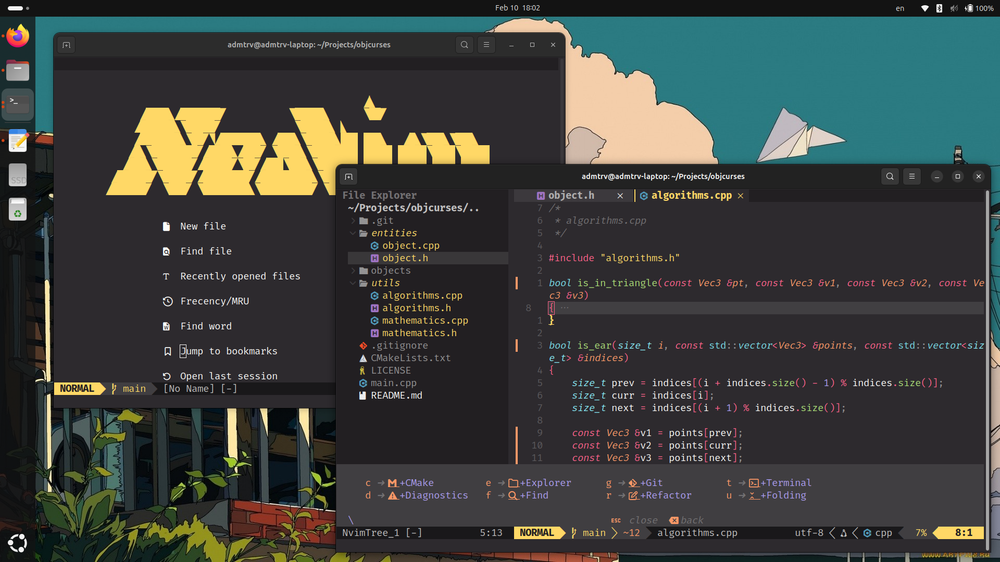
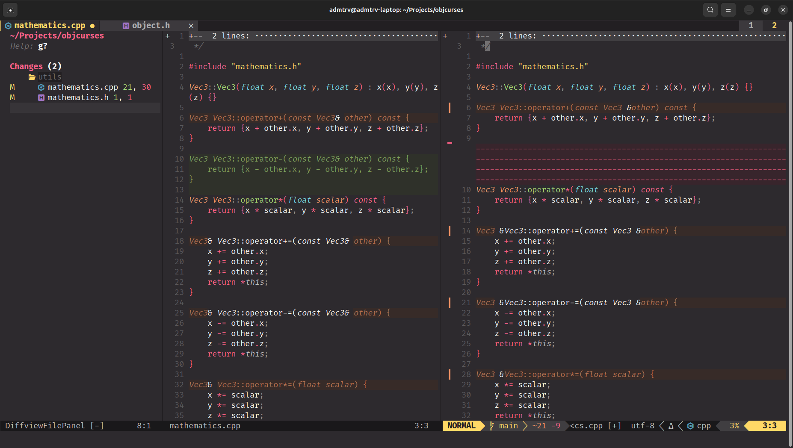

# Lightweight Neovim Config for C/C++ Development

This repository contains my personal, lightweight Neovim configuration tailored for C/C++ projects. Below are key features:

## Features

- Custom start screen
- Bottom status bar 
- File explorer
- Top tab bar displaying all open files, each in its own tab

---

- Autocompletion and suggestions
- Syntax highlighting 
- Git difference side panel that highlights inline changes
- Autoformatting with clangd format
- Code structure panel displaying functions and classes with their contents
- Error diagnostics panel

---

- Side-by-side difference layout to compare changes in detail
- Full git workflow support

---

- Integrated terminal
- Improved search for live file and text lookup within the editor

## Dependencies
- Install a recent version of `nvim`
- Basic utils as `git`, `make`, `unzip`, `gcc`, `gdb`
- `clangd` language server and `clangformat`
- [ripgrep](https://github.com/BurntSushi/ripgrep) for better text search
- [Nerd Font](https://www.nerdfonts.com/) provides wide range of icons

Upon startup, plugins will be installed and set up automatically by [lazy.nvim](https://github.com/folke/lazy.nvim). You can explore `init.lua` and map hotkeys to adapt config to your workflow!
